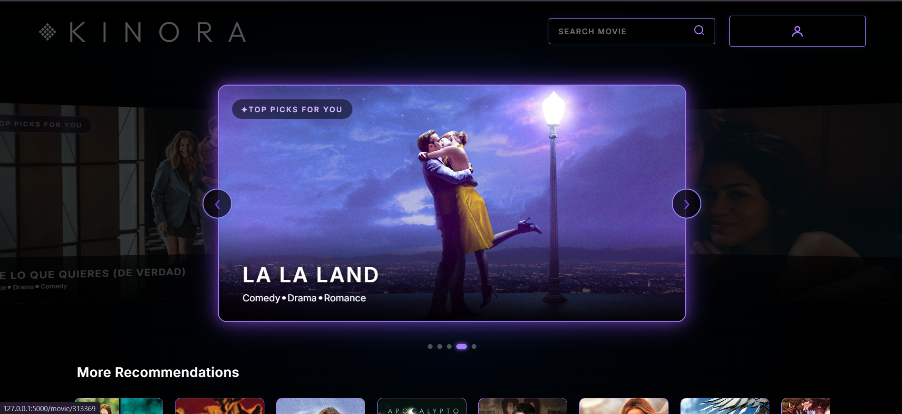
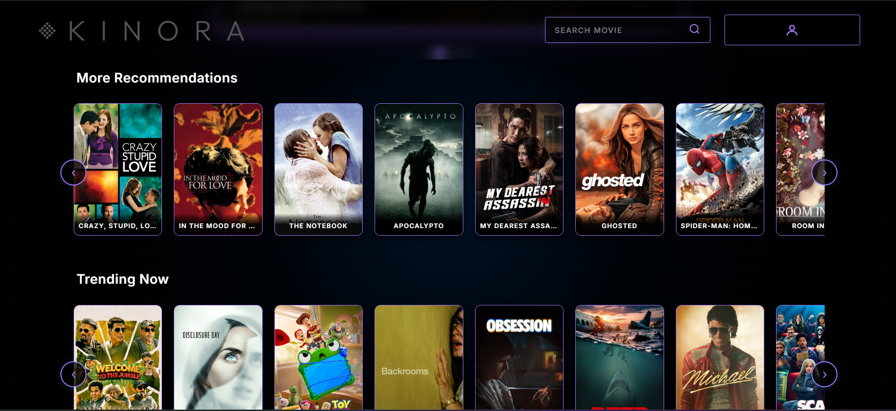
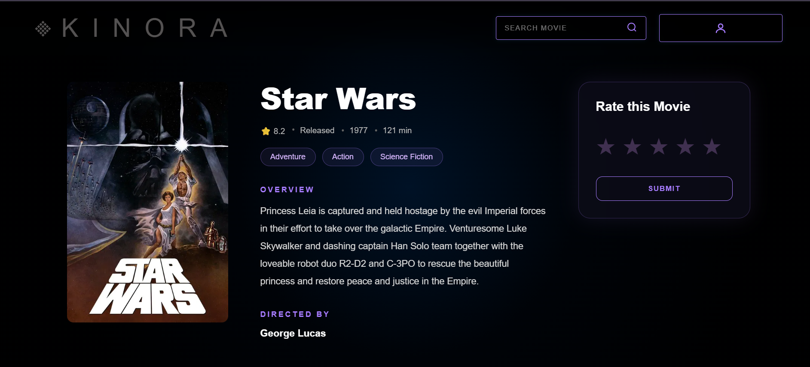
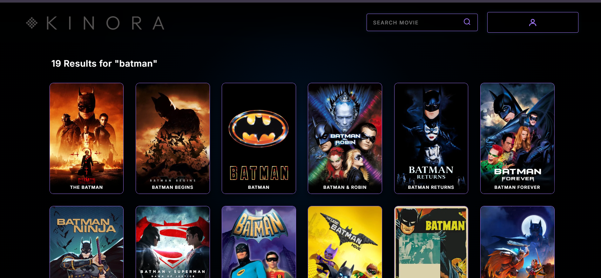

# 🎬 KINORA

KINORA is a personalized movie recommendation web application built using **Flask** and powered by a **Two-Tower Neural Network**. It delivers real-time personalized movie recommendations by learning user and movie embeddings while integrating seamlessly with the TMDB API for rich movie metadata, posters, and cast information.

---



---

## ✨ Features

- Personalized movie recommendations
- Similar movie recommendations using embedding similarity
- Movie search powered by TMDB
- Rate movies and continuously improve recommendations
- User authentication and profile management
- Cold-start recommendations based on favorite genres
- Detailed movie pages with cast, director, runtime, genres, and overview
- Responsive and modern user interface

---

## 🛠 Tech Stack

### Backend
- Python
- Flask
- SQLAlchemy
- MySQL

### Machine Learning
- TensorFlow / Keras
- Two-Tower Neural Network
- NumPy
- Pandas
- Scikit-learn

### Frontend
- HTML
- CSS
- JavaScript
- Jinja2

### APIs
- TMDB API

---

## 🧠 Machine Learning

KINORA uses a **Two-Tower Neural Network** to generate personalized movie recommendations by learning user and movie embeddings. The trained models are exported and integrated into the Flask application for real-time recommendation inference.

The complete machine learning workflow—including preprocessing, feature engineering, model architecture, training, evaluation, and deployment—is documented separately inside the **`ML/`** directory.

---

## 📁 Project Structure

```text
KINORA/
│
├── app.py
├── config.py
├── database.py
├── models.py
├── movie_utils.py
├── requirements.txt
│
├── services/
│   ├── recommender.py
│   └── tmdb.py
│
├── scripts/
│   ├── populate_movie.py
│   ├── precompute_movie_embeddings.py
│   └── populate_user_embeddings.py
│
├── ML/                # Machine Learning pipeline and documentation
├── new_model/         # Exported models and preprocessing objects
├── static/
├── templates/
└── screenshots/
```

---
### File Overview

| File | Purpose |
|------|---------|
| `app.py` | Main Flask application containing routes and request handling |
| `config.py` | Stores application configuration and environment variables |
| `database.py` | Initializes the SQLAlchemy database connection |
| `models.py` | Defines the User, Movie, and Rating database models |
| `movie_utils.py` | Utility functions for movie feature construction and embedding generation |
| `services/recommender.py` | Handles recommendation generation, user embedding updates, and similarity search |
| `services/tmdb.py` | Wrapper around the TMDB API for movie details, search, and credits |
| `scripts/populate_movie.py` | Imports movies into the database |
| `scripts/populate_movie_embeddings.py` | Generates and stores movie embeddings |
| `scripts/populate_user_embeddings.py` | Computes user embeddings from ratings |
| `ML/` | Machine learning pipeline, training notebooks, and documentation |
| `new_model/` | Exported TensorFlow models and preprocessing objects |
---
## 🗄️ Database

KINORA uses **MySQL** with **SQLAlchemy ORM**. The database schema is defined in `models.py` and consists of three core models:

- User
- Movie
- Rating

The relationships are:

```text
User (1) ───────< Rating >─────── (1) Movie
```
---

## 🚀 Getting Started

### Clone the repository

```bash
git clone https://github.com/AmenRosh004/KINORA.git
cd KINORA
```

### Install dependencies

```bash
pip install -r requirements.txt
```

### Configure Environment Variables

Create a `.env` file in the project root and add the following variables:

```env
SECRET_KEY=your_secret_key
DATABASE_URL=your_database_url
TMDB_API_KEY=your_tmdb_api_key
```

| Variable | Description |
|----------|-------------|
| `SECRET_KEY` | Any random secret string used by Flask to secure user sessions. |
| `DATABASE_URL` | Your MySQL database connection string. |
| `TMDB_API_KEY` | Your API key obtained from The Movie Database (TMDB). |

You can obtain a free TMDB API key by creating an account at https://www.themoviedb.org/ and requesting an API key from your account settings.

### Run the application
```bash
python app.py
```

Open your browser and visit:

```text
http://127.0.0.1:5000
```

---


## 📸 Screenshots

### Home



---

### Movie Details



---

### Search Results



---

## Future Improvements

- Hybrid recommendation system
- Director and cast embeddings
- Movie keyword and overview embeddings
- User watchlists and favorites
- Recommendation explanations

---

## 📄 License

This project was developed for educational and portfolio purposes.